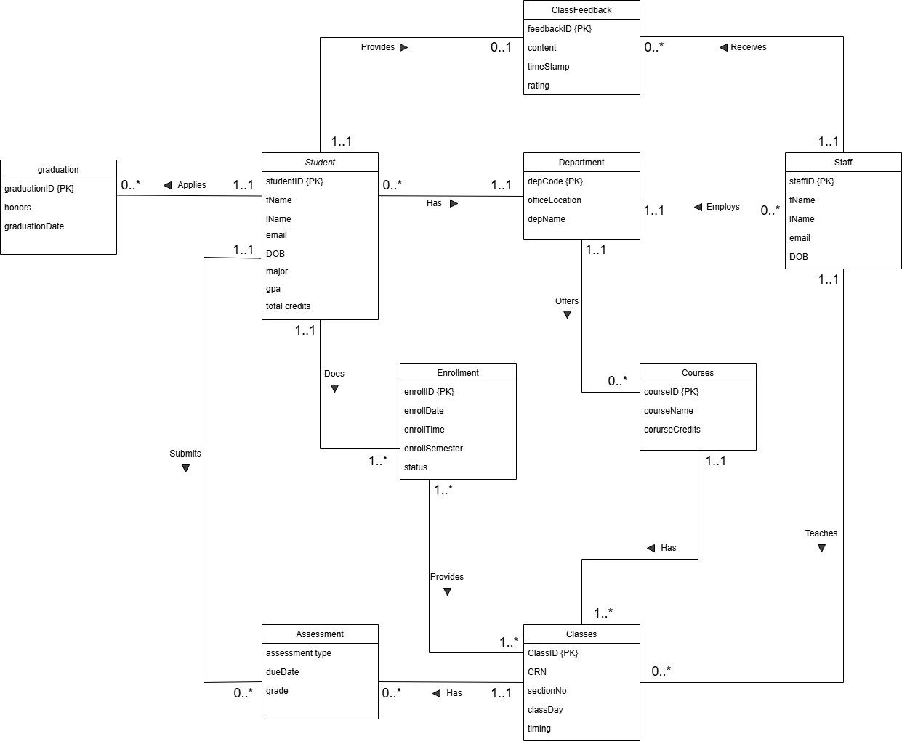
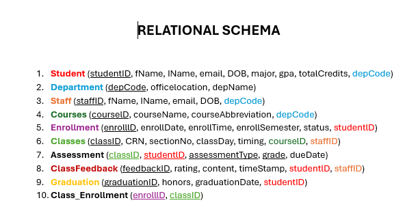
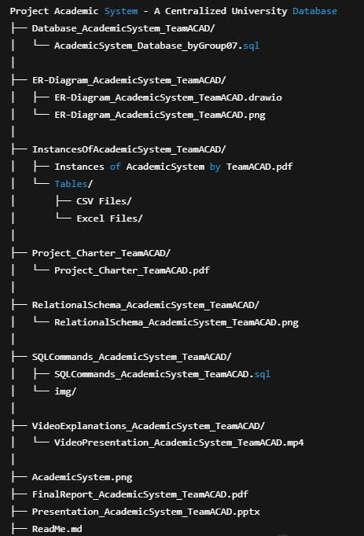

# Academic System – Centralized University Database 

---

## **Project Overview**

**Project Name:** Academic System  
**Institution:** Kwantlen Polytechnic University  
**Team:** Team ACAD (Gurnoor Kaur, Sukhdeep Singh, Jashanpreet Kaur, Kartik Palta)  
**Course:** INFO 2312 – Database Systems  
**Duration:** Jan 2025 – Apr 2025  

---

## **Introduction**

This project designs and implements a fully normalized centralized academic database for the fictional **Jaegar State University**, addressing the need to streamline academic operations such as student registration, instructor assignments, course management, assessments, graduation tracking, and feedback collection.

By consolidating fragmented academic processes into a single MySQL database, the Academic System improves data integrity, efficiency, and access to real-time information for students, instructors, and administrative staff.

---

## **Key Features**

- **10 Interconnected Entities:**  
  Student, Staff, Department, Courses, Classes, Enrollment, Assessment, Graduation, Class_Enrollment (bridge table), ClassFeedback.
  
- **Structured Feedback Mechanism:**  
  Students can submit ratings and written feedback on staff performance.

- **Comprehensive Academic Operations Support:**  
  - Student course registration and academic record tracking.  
  - Instructor course assignment and workload management.  
  - Assessment recording and grading.  
  - Graduation eligibility tracking.  
  - Real-time feedback analysis.

- **Data Integrity & Security:**  
  Foreign key constraints, normalized relational schema, and enforced referential integrity.

- **Sample Data:**  
  Simulated real-world data with 20+ students and 10+ instructors.

---

## **Entity-Relationship (ER) Diagram**

---

## **Relational Schema**

---

## 📂 Project Folder Structure Overview

---

## 📺 Video Presentation

▶️ [Watch the Video Presentation on OneDrive](https://kpuemp-my.sharepoint.com/:v:/g/personal/sukhdeep_singh14_student_kpu_ca/EZMvpy8JjTlDsHw7dh22uiMBFB7NhrRg8gbBIHdZC_gJ0A?e=LwDWWj)

---

## **Database Technologies**

- **Database Management System:** MySQL Workbench
- **SQL Features Used:**  
  - Structured Query Language (DDL and DML)  
  - Constraints (PRIMARY KEY, FOREIGN KEY)  
  - Cascading updates and deletes  
  - INNER JOINs and Aggregations

---

## **Core SQL Queries Developed**

- **Department-wise Course Offerings:**  
  See how many courses each department offers.

- **Instructor Workload Analysis:**  
  Find the number of classes each instructor is currently teaching.

- **Feedback Analysis (A+ Ratings):**  
  Identify top-rated instructors based on student feedback.

- **Class Schedules (1 PM Classes):**  
  Retrieve all classes scheduled at exactly 1:00 PM.

- **Departmental GPA Performance:**  
  Calculate the average GPA across departments.

---

## **Sample Outputs**

Queries were designed to simulate real academic reports for department heads, instructors, and administrative staff to support operational planning and analysis.

---

## **Challenges and Lessons Learned**

- **Challenge:** Ensuring referential integrity and maintaining consistent foreign key constraints across all tables.  
- **Lesson Learned:** Importance of sequencing SQL inserts correctly and structuring queries carefully to match real-world academic workflows.

---

## **Team Roles**

| Member Name      | Role                  |
|------------------|------------------------|
| Gurnoor Kaur      | Project Manager        |
| Sukhdeep Singh    | Test Engineer          |
| Jashanpreet Kaur  | Database Developer     |
| Kartik Palta      | Software Programmer    |

---

## **How to Use the Project**

1. Open MySQL Workbench.
2. Import the provided SQL schema: `Database_AcademicSystem_TeamACAD/AcademicSystem_Database_byGroup07.sql`.
3. Populate tables with sample data (available in `InstancesOfAcademicSystem_TeamACAD/Instances of AcademicSystem by TeamACAD.pdf`).
4. Execute sample queries provided in `SQLCommands_AcademicSystem_TeamACAD/SQLCommands_AcademicSystem_TeamACAD.sql` for reporting insights.

> **Tip:** Always run the `USE AcademicSystem;` command first before executing any queries.

---

## **Deliverables**

- 📚 **Project Charter** (`Project_Charter_TeamACAD/`)  
- 🛠️ **ER Diagram** (`ER-Diagram_AcademicSystem_TeamACAD/`) & **Relational Schema** (`RelationalSchema_AcademicSystem_TeamACAD/`)  
- 💾 **SQL Schema and Sample Queries** (`Database_AcademicSystem_TeamACAD/`, `SQLCommands_AcademicSystem_TeamACAD/`)  
- 📈 **Project Presentation** (`Presentation_AcademicSystem_TeamACAD/`)  
- 📝 **Final Report with Business Rules and Sample Outputs** (`FinalReport_AcademicSystem_TeamACAD.pdf`)

---

## **References**

- Team ACAD Project Files
- INFO 2312 – Database Systems (Kwantlen Polytechnic University)

---

## **Acknowledgements**

Special thanks to **Professor Caesar Lopez Castellanos** for the guidance throughout the project.

---

# 🚀 Thank You for Exploring the Academic System Project!
